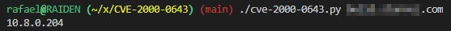

# CVE-2000-0649
CVE-2000-0649 is a low risk vulnerability that can potentially disclose the internal IP addresses of the server. Official details are here:

* [Rapid7](https://www.rapid7.com/db/modules/auxiliary/scanner/http/iis_internal_ip/)
* [CVE](https://www.cvedetails.com/cve/CVE-2000-0649/)
* [NIST](https://nvd.nist.gov/vuln/detail/CVE-2000-0649)

This particular vulnerability became of interest to me because it seems to affect current NGINX and some Apache setups as well. This tool tests for the vulnerability on a given IP or domain, and is deliberately light on the output so that it can be used with other scripts. When it works, it should look something like this:



Otherwise, there will be no output. We fixed this in NGINX by adding the following line to `/etc/nginx/nginx.conf`:

```bash
server_name_in_redirect on
```

Thanks!